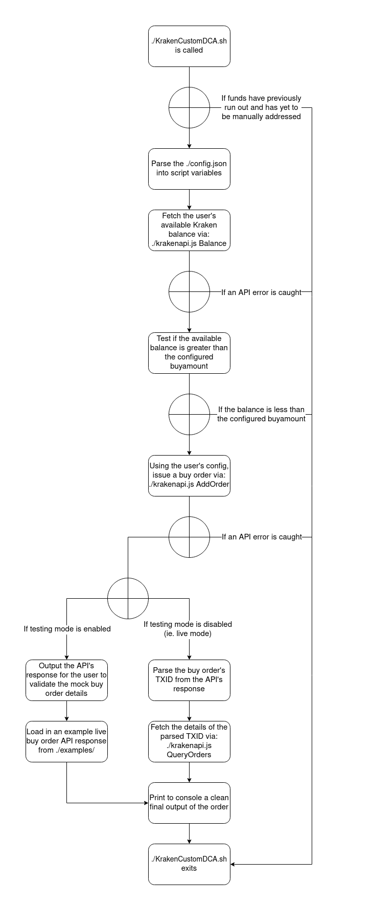

# $\color{#7132f5}{Kraken\ Custom\ Dollar\ Cost\ Averaging}$

If you use Kraken as your go-to crypto exchange, it's likely you've come across their Daily Cost Averaging investment system in the base version of Kraken.

By itself, it is a nice DCA investment option that works well for the average user, but what about "pro" users? Like with the "pro" trading version of Kraken, what about a "pro" DCA platform that has highly customizable configurations, not just "Daily/Weekly/Monthly" options? What about fees that match the "pro" trading maker/taker structure?

Well, technically there is a "pro" version of their DCA platform, it's called the Kraken API.

By utilizing the NodeJS Kraken API client made by the official Kraken dev team, it is entirely possible to create a custom DCA platform that has custom buy frequencies while matching the "pro" trading maker/taker fees. So, that is exactly what I made here with this project.

In short, I wrote a Bash script that calls the NodeJS Kraken API client to check the user's balance and issue buy orders to the user's specification if conditions are met. If you configure a scheduling service to call the script, like "_crontab_", you can automate these buy orders to whatever schedule you want. No longer are you restricted to just "Daily/Weekly/Monthly"!

Take a look at my flow chart to understand how the script works:

## $\color{#7132f5}{Example\ Usage}$

> -._,-'"\`-._,-'"\`-._,-'"\`-._,-'"\`-._,-'-._,-'"\`-._,-'"\`-._,-'"\`-._,-'"\`-._,-'"\`-.\_,-'"\`-.\_,-'"\`-
>
> [2024-xx-xx xx:09:02] Balance: 13 USD | Buy Amount: 5 USD | Sufficient Funds | Executing...  
> [xxxxxx-xxxxx-xxxxxx] Exchanged 5.00000 USD for 0.00005230 BTC @ 95602.2 USD / 1 BTC (Fee: 0.02000 USD)
>
> -._,-'"\`-._,-'"\`-._,-'"\`-._,-'"\`-._,-'-._,-'"\`-._,-'"\`-._,-'"\`-._,-'"\`-._,-'"\`-.\_,-'"\`-.\_,-'"\`-
>
> [2024-xx-xx xx:10:02] Balance: 8 USD | Buy Amount: 5 USD | Sufficient Funds | Executing...  
> [xxxxxx-xxxxx-xxxxxx] Exchanged 5.00000 USD for 0.00005230 BTC @ 95602.2 USD / 1 BTC (Fee: 0.02000 USD)
>
> -._,-'"\`-._,-'"\`-._,-'"\`-._,-'"\`-._,-'-._,-'"\`-._,-'"\`-._,-'"\`-._,-'"\`-._,-'"\`-.\_,-'"\`-.\_,-'"\`-
>
> [2024-xx-xx xx:11:02] Balance: 3 USD | Buy Amount: 5 USD | Insufficient funds | Stopping...  
> To restart automation, re-fund your account, then delete /home/.../KrakenCustomDCA/NOFUNDS.  
> The next scheduled crontab iteration will proceed as normal.
>
> -._,-'"\`-._,-'"\`-._,-'"\`-._,-'"\`-._,-'-._,-'"\`-._,-'"\`-._,-'"\`-._,-'"\`-._,-'"\`-.\_,-'"\`-.\_,-'"\`-

## $\color{#7132f5}{Important\ Notes}$

- Obviously, you will need a KYC completed Kraken account with funds ready to be spent.
- This project is only focused on **SPOT MARKET BUYS**, meaning:
  - Anything that is _NOT_ a spot trade is _EXCLUDED_.
  - Anything that is _NOT_ a market order is _EXCLUDED_.
  - Anything that is _NOT_ a buy order is _EXCLUDED_.
- Trading fees are set to be deducted from the _crypto_ you are receiving. ie. if you buy $5 worth of BTC with $0.02 in fees, your account will show -$5, instead of -$5.02. This enables you to fund _exact_ amounts without worrying about adding more to cover fees, ie. [$10 x 30 days = $300] vs [$10.04 x 30 days = $301.20]
- If you let your Kraken balance run out and the script detects it during an iteration:
  - A file called "NOFUNDS" will be created in the project directory to prevent the script from doing anything.
  - The crontab will continue to run per scheduled times, but until you delete "NOFUNDS" after re-funding your balance, the script will be effectively disabled.

## $\color{#7132f5}{Prerequisites}$

### Hardware:

- Any computer, really... Something very low power to run 24/7
  - _Recommended: [Raspberry Pi Zero 2W](https://www.raspberrypi.com/products/raspberry-pi-zero-2-w/)_

### Operating System:

- A Debian based distro
  - _Recommended: [Raspberry Pi OS Lite (64-bit)](https://www.raspberrypi.com/software/)_

### Knowledge:

- General Linux knowhow, including using Linux in a command line only environment via SSH.
- A basic idea of how Kraken's REST API works, including the API key system.
- Prior programming experience isn't needed but is a huge benefit.

## $\color{#7132f5}{Setup}$

<b>Step 1: Preparing the Linux environment</b>
 

This guide assumes...

- You are using a Raspberry Pi platform running on the Raspberry Pi OS Lite (64-bit) operating system.
- You are SSH'd into your already flashed and fully up-to-date device as a user with sudo powers.

Make sure all required packages are installed:

    sudo apt update && \
    sudo apt install jq npm git

I recommend creating a new user dedicated to this project, one without sudo powers and cannot directly be accessed via SSH:

    sudo adduser kcdca

Disable SSH capabilities for that user:

    sudo usermod -s /usr/sbin/nologin kcdca

Log into the user you just created:

    sudo -su kcdca && \
    cd ~

> <u>Note</u>:
>
> You can skip making a dedicated user and just run the project on your normal sudo-enabled user. However, considering this project involves automation and money, taking extra security precautions at every turn is warranted.
>
> If you DID make a dedicated user, you need to remember that this project will be operating under the _kcdca_ user. If you somehow lose access to this user while automation has been enabled, **immediately** delete your Kraken API keys to stop the DCA orders from being placed until you are able to regain control. Also, simply powering off the device works too.

<b>Step 2: Preparing the project's environment</b>
 

Clone this repository and enter the project's directory:

    git clone https://github.com/Katyatu/KrakenCustomDCA.git && \
    cd KrakenCustomDCA

Setup the project's NodeJS environment:

    npm i axios

<b>Step 3: Create 2 blank files to hold your Kraken API keys</b>
 

    touch API_PUBLIC_KEY API_PRIVATE_KEY

<b>Step 4: Setup your Kraken API keys</b>
 

Official Kraken support article on API key generation:

    https://support.kraken.com/hc/en-us/articles/360000919966-How-to-create-an-API-key

**<u>Required</u>** API permissions:

- Funds permission:
  - _Query_ - Checking fiat balance.
- Orders and trades:
  - _Query closed orders & trades_ - Getting details of the placed order.
  - _Create & modify orders_ - Placing the DCA market orders.

**<u>Leave all other permissions unchecked!</u>**

_Recommended_ key options:

- _IP address restriction_ - So that even if your keys get compromised, they can't be used without being on your currently used IP address. Use the below command to query your public IP supplied from ipleak.net:

        wget -qO- https://ipleak.net/json | jq .ip | tr -d '"'

- _Key expiration_ - I recommend rotating keys monthly, so, pick the end of the month.
- _Query start date_ - Pick the current date.
- _Query end date_ - Pick the same date as _Key expiration_.

Once you're happy with the key config, generate the API key. These keys will only be shown once, so don't close the key info box until you:

- Copy the generated "_Public Key_" and paste it inside the "_API_PUBLIC_KEY_" file you made in Step 3.

        nano API_PUBLIC_KEY

- Copy the generated "_Private Key_" and paste it inside the "_API_PRIVATE_KEY_" file you made in Step 3.

        nano API_PRIVATE_KEY

<b>Step 5: Get Kraken's official NodeJS API Client</b>
 

Official Kraken support article on their NodeJS API Client:

    https://support.kraken.com/hc/en-us/articles/6814153290004-REST-API-command-line-client-NodeJS-

Either manually download the file from Step 2 of the support article into the project directory, renaming it as "_krakenapi.js_", or run the following command:

    wget -O "krakenapi.js" https://assets-cms.kraken.com/files/51n36hrp/support-center/483ec6a27e440d9a347817b31186687888fd584a.js

Look inside the downloaded .js file to verify legitimacy:

    cat krakenapi.js

<b>Step 6: Set your personal DCA config</b>
 

    nano config.json

- _testing_ | boolean | Default: true
  > When set to true, a dry-run is conducted to validate inputs and expose errors without placing live orders. If there are no errors and the API responds with the order description you want to DCA with, set this to false to go live.
- _crypto_ | string | Default: BTC
  > Kraken's crypto asset code for the coin you want to buy. A list can be found under the "_cryptocurrency_" asset type here:  
  > https://support.kraken.com/hc/en-us/articles/360001185506-How-to-interpret-asset-codes
- _fiat_ | string | Default: USD
  > Kraken's fiat asset code for the fiat you want to trade with. A list can be found under the "_cash_" asset type here:  
  > https://support.kraken.com/hc/en-us/articles/360001185506-How-to-interpret-asset-codes
- _buyamount_ | int | Default: 5
  > The amount of fiat you want to use in exchange for your crypto. Must be above Kraken's minimum buy amount, which can be found here:  
  > https://support.kraken.com/hc/en-us/articles/360001389303-Overview-of-cryptocurrency-minimums

> <u>Note:</u>
>
> config.json **MUST** be a valid JSON object. Breaking the JSON structure **WILL** break the main script. Be careful!

<b>Step 7: Test & Verify</b>
 

Look inside "_KrakenCustomDCA.sh_" so you have an idea on how this project operates:

    cat ./KrakenCustomDCA.sh

If you're happy with what you see, enable the ability to execute it:

    chmod u+x ./KrakenCustomDCA.sh

Manually run the main script with the config.json "_testing_" variable set to **true**:

    ./KrakenCustomDCA.sh

If the Kraken API isn't happy with something, the API response error will be displayed and the script halted. To diagnose, here is Kraken's support article for API errors:

    https://docs.kraken.com/api/docs/guides/spot-errors/

Otherwise, you should see an output like this:

> !!! TESTING MODE IS ACTIVE !!! EXAMPLE DATA USED !!! NO ORDERS ARE PLACED !!!  
> [2024-01-01 00:00:00] Balance: 5 USD | Buy Amount: 5 USD | Sufficient Funds | Executing...  
> \> {"error":[],"result":{"descr":{"order":"buy 5.00000000 XBTUSD @ market"}}}  
> \> Make sure the above api's buy order response is what you want executed.  
> \> Adjust config vars if needed, live buy orders are irreversible!  
> \> A successful live buy order will output a result like this:  
> [THISIS-ANEXA-MPLEID] Exchanged 5.00000 USD for 0.00005 BTC @ 100000.0 USD / 1 BTC (Fee: 0.02000 USD)

If there are...

- No API errors
- The balance reflects your Kraken account's balance and is greater than your buy amount
- The buy amount reflects what you set in config.json
- The crypto-fiat pair reflects what you set in config.json

...then you are ready to go live! Go back to Step 6 and set "_testing_" to **false** to enable making live buy orders the next time "_KrakenCustomDCA.sh_" is executed.

To make your first manual live buy order, simply run "_KrakenCustomDCA.sh_":

    ./KrakenCustomDCA.sh

If all goes well, you should get a clean output like this (minus the personal redactions):

> [2024-xx-xx xx:xx:xx] Balance: x USD | Buy Amount: 5 USD | Sufficient Funds | Executing...  
> [xxxxxx-xxxxx-xxxxxx] Exchanged 5.00000 USD for 0.00005139 BTC @ 97295.1 USD / 1 BTC (Fee: 0.02000 USD)

<b>Step 8: Automation</b>
 

Since this script is a one-time execution, meaning 1 run = 1 buy, you will need to implement a way to schedule executions if you want to actually turn these buy orders into a Dollar Cost Averaging strategy.

The way we can do this is to utilize the power of "_crontab_". If you are not familiar with it, take a look here:

    https://linuxhandbook.com/crontab/

With "_crontab_", we can set any kind of recurring schedule to execute "_KrakenCustomDCA.sh_" (within API rate limits). Kraken's built-in DCA system is limited to as frequent as one buy a day, which might not be frequent enough for people who make big daily buys. This script enables us to break our daily buys down to Kraken's bare minimum buy amount while still maintaining our total daily investment goal.

Now, the desired schedule varies between users due to factors like preferred hours/days to buy and total daily investment goal. "_crontab_" is good at calculating even the most niche schedules, but might be difficult to figure out the right syntax that matches the schedule you want.

This website can help you figure that out:

    https://crontab.guru/

For example, if you want to...

- Invest $15 every day of the week
  - Broken up into 3 $5 buy orders
    - Executing a buy order every 8 hours
      - 12:00am, 08:00am, 04:00pm
        - 0 0/8 \* \* \*
- Invest $20 every weekday (Mon - Fri)
  - Broken up into 4 $5 buy orders
    - Executing a buy order every 6 hours
      - 12:00am, 06:00am, 12:00pm, 06:00pm
        - 0 0/6 \* \* 1-5
- Invest $30 every day of the week
  - Broken up into 6 $5 buy orders
    - Executing a buy order every 2 hours between 06:00pm and 04:00am
      - 12:00am, 02:00am, 04:00am, 06:00pm, 08:00pm, 10:00pm
        - 0 0-4/2,18-23/2 \* \* \*

Once you've figured out the right scheduling syntax, make note of your "_KrakenCustomDCA.sh_" absolute path with:

    realpath ./KrakenCustomDCA.sh

Then, open up your user's "_crontab_":

    crontab -e

You want to structure the syntax like this at the bottom of the file:

    <schedule syntax> <absolute path of KrakenCustomDCA.sh>

For example:

    0 0 * * * /home/<user>/KrakenCustomDCA/KrakenCustomDCA.sh

You will also want to be keeping a ledger of the script outputs to track how the automation is doing, ie. TXIDs and errors. Direct the script outputs to a file in the project directory like this:

    0 0 * * * /home/<user>/KrakenCustomDCA/KrakenCustomDCA.sh >> /home/<user>/KrakenCustomDCA/ledger.log

Save the "_crontab_" and exit. The changes are applied immediately and the next occurrence of your scheduled syntax will run the script with your given configuration.

That's it, congrats! You are set up with enhanced DCA investing!

Once your "_crontab_" does it's first iteration, there should be a "_ledger.log_" in the project directory containing the details of your first DCA order (and all future orders/script outputs). Be sure to check the "_ledger.log_" regularly to make sure the automation is going smoothly.

    cat ./ledger.log

> <u>Note:</u>
>
> If you want to stop the automation, remove your "_crontab_" line.
>
> If you are also finished using this project, revoke your API keys and delete the "_KrakenCustomDCA/_" folder.

<b>Bonus: Maintenance</b>
 

In the spirit of always bolstering your privacy and security, I highly recommend that every month you...

- Check for system updates to stay up to date:

        sudo apt update && sudo apt full-upgrade && sudo apt autopurge && sudo apt autoclean && sudo reboot

- Rotate your Kraken API keys, revisiting Step 4 & 7.

- Withdraw your invested crypto into an air-gapped wallet.

  > For example with bitcoin: TailsOS + Bitcoin Core  
  > TailsOS: https://tails.net/  
  > Bitcoin Core: https://github.com/bitcoin/bitcoin/releases  
  > Air-gapped Tutorial: https://github.com/bitcoin/bitcoin/blob/master/doc/offline-signing-tutorial.md

- Rotate out the current crypto withdrawing address with a new address to enhance your blockchain privacy.
- Check back at this repository for any updates.

## $\color{#7132f5}{Closing\ Thoughts}$

I hope you enjoy and find good use from my project, happy investing!

If you have any ideas of improvement or want to report any issues, reach out to me!
